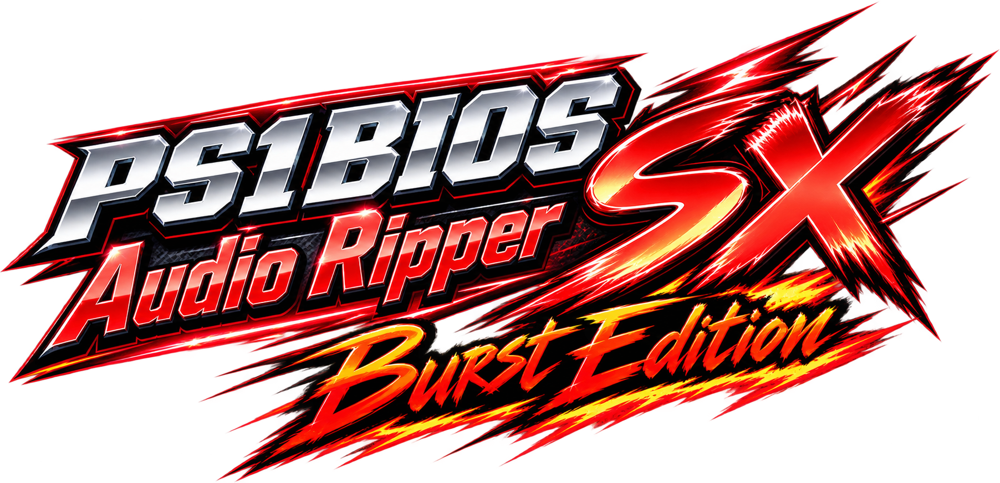
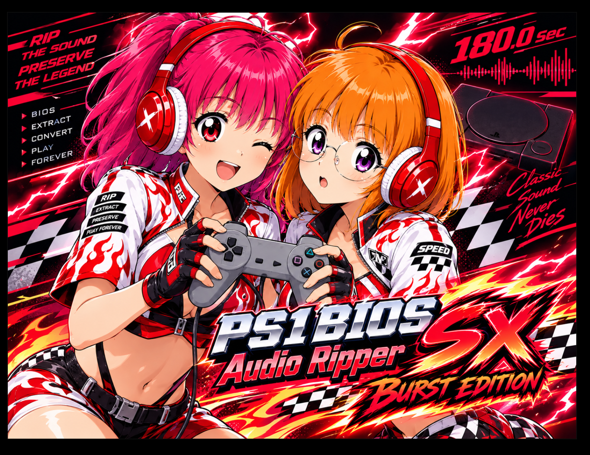

# PS1 BIOS Audio Ripper SX — Burst Edition

## このプロジェクトの目的

所有する実機PlayStationの512 KiB BIOSを、アナログオーディオ出力を使って転送し、**180秒以内にブラウザへダウンロードできるようにする**ことを目標とする高速実験版です。

PlayStation側でBIOSデータを音声信号へ変調し、ブラウザ側で受信・復調・誤り検出／訂正・BIOS再構成を行います。BIOSデータはサーバーへ送信せず、サイズおよび全体CRCの検証に成功した場合のみローカルへ保存します。

## 位置づけ

Burst Editionでは、安定動作を優先した通常版とは別に、実機の音響特性とキャプチャ環境に合わせた高速変調・復調方式を検討します。現行のBurst V6は、開始信号の後にFSKヘッダを挟まず、連続ステレオOFDMだけで転送します。

- 目標時間: 180秒以内
- 対象データ: 初代PlayStation BIOS 512 KiB
- 送信経路: 実機のアナログ音声出力
- 受信環境: Web Audio対応ブラウザ
- 完了条件: 全ブロックとBIOS全体のCRC検証成功

## 現行Burst V6の高速化仕様

- 44.1 kHz stereo OFDM / 512-point FFT / CP 32 samples / 96 carriers
- 16QAM、1パケット4 OFDMデータシンボル、ペイロード280 bytes
- 内側SECDED（(72,64) Hamming）と外側16+6 shard FEC
- ブロックごとにRAW・LZSS・固定Huffman Deflateから最小サイズを選択
- ステレオ開始信号の後は無音区間やFSKブロックヘッダを置かず連続送信

合成ランダムデータのローカルループバックでは、88パケット／4 FECグループを全復元し、C demodulator・ブラウザWorkerともにイメージCRC32一致を確認しています。これは静的・合成検証であり、物理PlayStationからの録音成功はまだPENDINGです。

## V2圧縮（互換追加経路）

Mac Studioの24物理コアで複数codecを比較した結果、BIOSを次の2領域へ分ける方式を採用候補として組み込んだ。

- `0x000000–0x044C60` のMIPS領域: LZMA2、辞書256 KiB、`lc=2 / lp=2 / pb=2`
- `0x044C60–0x080000` のリソース領域: LZMA2、辞書256 KiB、`lc=3 / lp=0 / pb=2`
- V2ヘッダはcodec、領域オフセット／サイズ、各CRC、LZMAプロパティを自己記述する
- `make v2-lzma-test` でMac Studioホスト基準の圧縮・復元・CRC回帰テストを実行できる
- `make v2-lzma-encode ARGS='--input BIOS --output CONTAINER'` でMacホスト上の候補コンテナを生成できる

実BIOSでのホスト基準値は **197,887 bytes**（524,288 bytesから326,401 bytes削減、62.26%削減）だった。これは200,000 bytes目標を2,113 bytes下回る。V2は既定のV1送信経路を変更せず、`-DSX_CONTAINER_VERSION=2` を指定したPS1ビルドで選択できる。PS1側は2 MiB RAMと常駐モデムバッファを考慮した低メモリLZMA2プロファイル（辞書64 KiB、標準LZMA2属性）を使い、正常に圧縮できても小さくならない領域だけRAWへフォールバックする。LZMA2実行エラーは `ERROR` を表示して処理を停止する。V2の復号は `web/lzma2-decoder.wasm` で行い、領域CRCと全体CRCが一致した場合だけBIOS保存を許可する。

ホストの197,887 bytesはMac Studioのliblzma基準値であり、PS1低メモリプロファイルの実BIOSサイズとは別の測定値である。PS1のV2画面には圧縮時間、サイズ、圧縮率、削減量、およびLZMA2失敗時の領域番号・エラーコード・RAWフォールバックを表示する。ホストテスト、生成PCMループバック、DuckStation実行、実機PlayStationからの音声復元は別々の検証層として扱う。実機音声復元は引き続き `PENDING` である。

ビルド成功、合成音声のループバック、エミュレータでの動作だけでは実機成功とは扱いません。最終的な達成判定は、物理PlayStationから録音した音声をブラウザで復元できた場合に行います。

## イメージキャラクター

上記ビジュアルは「PS1 BIOS Audio Ripper SX — Burst Edition」のイメージキャラクターです。

> RIP THE SOUND — PRESERVE THE LEGEND.
